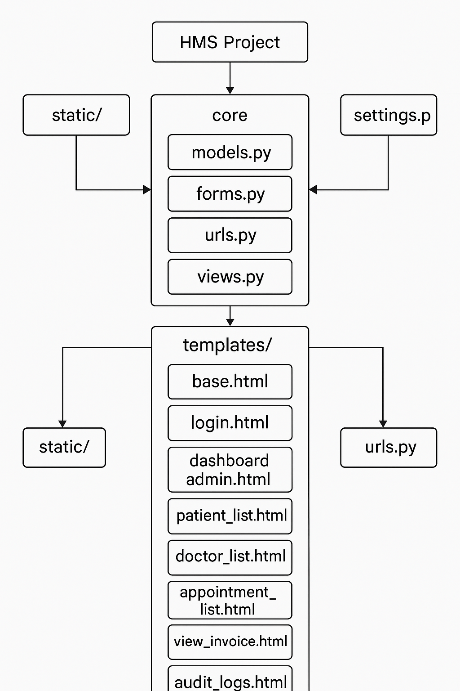
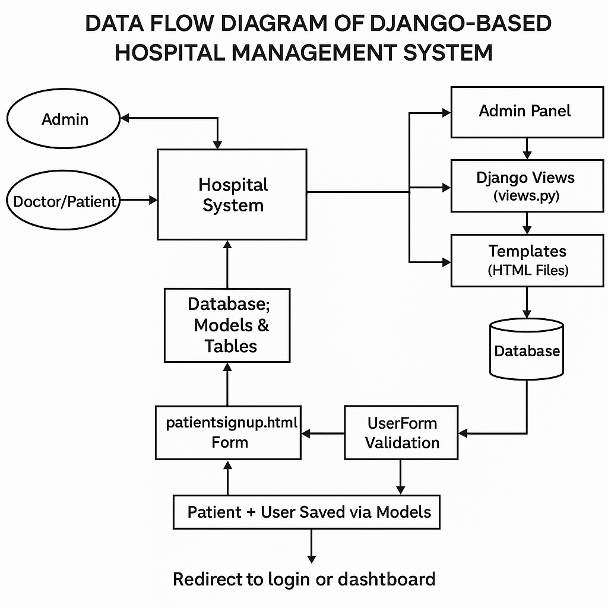
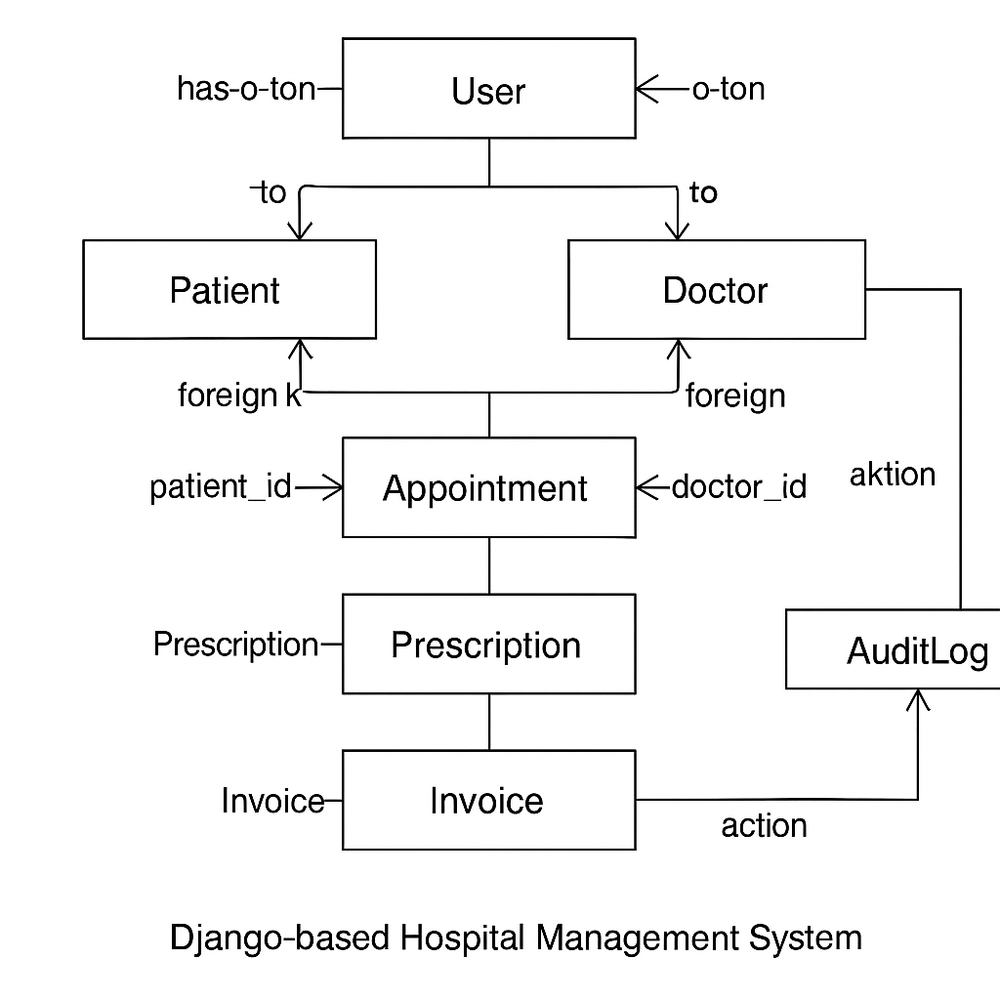

# 🏥 **Hospital Management System — Full Stack Django Application**

<p align="center">
  
</p>

A comprehensive **Hospital Management System** built with **Django**, **Stripe Payments**, **Bootstrap**, **JavaScript**, and a **relational database** (SQLite locally, PostgreSQL on Heroku).
This platform enables **Admins**, **Doctors**, and **Patients** to securely manage appointments, records, billing, discharge summaries, and online payments.

---

# 📖 **Table of Contents**

1. [📌 Project Overview](#-project-overview)
2. [👤 User Stories](#-user-stories)
3. [🎨 UX / UI Design](#-ux--ui-design)
4. [🛠 Technologies Used](#-technologies-used)
5. [📂 System Architecture](#-system-architecture)
6. [🗄 Data Models](#-data-models)
7. [🔐 Authentication & Authorization](#-authentication--authorization)
8. [📅 App Features](#-app-features)
9. [💳 Stripe Payment Integration](#-stripe-payment-integration)
10. [🧪 Validation, Testing & Lighthouse](#-validation-testing--lighthouse)
11. [🚀 Deployment Guide (Heroku)](#-deployment-guide-heroku)
12. [📁 File Structure](#-file-structure)
13. [🙏 Credits & Attribution](#-credits--attribution)
14. [📜 License](#-license)

---

# 📌 **Project Overview**

This **Hospital Management System** modernizes hospital operations with:

✔ Multi-role access: Admin, Doctor, Patient
✔ Appointment booking + management
✔ Doctor & patient onboarding
✔ Discharge summary & billing generator
✔ Stripe-powered online payment system
✔ Mobile-first responsive UI
✔ Django ORM + secure authentication
✔ Comprehensive validations & Lighthouse testing

---

# 👤 **User Stories**

Below are the full user stories built into this system.
Each story explains the **goal**, the **action**, and the **value delivered** to the user.

---

# 🧑‍⚕️ **Admin User Stories**

As an **Admin**, I want to:

---

### 🟢 **1. Register or Approve Doctors & Patients**

So that only trusted and verified users gain access to the hospital system.

**I should be able to:**

* View all pending registration requests
* Approve, reject, or delete accounts
* Ensure secure access to sensitive data
* See account status updates instantly

---

### 📝 **2. Add & Manage Appointments**

To maintain an organized schedule and prevent double-booking.

**This includes:**

* Creating new appointments
* Approving or denying appointment requests
* Rescheduling or cancelling bookings
* Viewing all appointments in date order

---

### 🔍 **3. View & Update Doctor/Patient Records**

So that hospital data remains accurate and up to date.

**I should be able to:**

* Search for users
* Edit or delete records
* Update profile information
* View medical or administrative details

---

### 🧾 **4. Generate Bills & Discharge Summaries**

To ensure smooth billing workflows and accurate documentation.

**I can:**

* Generate final invoices
* Add doctor fees, room charges, medicine fees
* Download discharge summaries
* Store records for future reference

---

### 📊 **5. Access the Admin Dashboard**

So that I can monitor overall hospital activity.

**Dashboard shows:**

* Pending approvals
* Total appointments
* Total patients and doctors
* Latest system activity

---

### 🔒 **6. Enforce Role-Based Authentication**

To ensure that restricted pages are only accessed by authorized roles.

---

# 🩺 **Doctor User Stories**

As a **Doctor**, I want to:

---

### 📅 **1. View My Appointments**

To quickly understand the daily schedule and patient list.

**I can:**

* View appointments assigned to me
* Sort by date and time
* Check patient names, symptoms, and notes

---

### 👨‍⚕️ **2. Access Assigned Patients**

To prepare for consultations.

**I can:**

* View patient details and medical history
* Access submitted symptoms and prior treatments
* See profile images for easy identification

---

### 💊 **3. Issue Prescriptions**

To provide correct treatment.

**I can:**

* Add medication names
* Add dosage & timings
* Create downloadable notes for patients

---

### 🗂 **4. View Past Discharge Summaries**

To understand patient history for future visits.

---

### 🛡 **5. Access Only My Patients**

To maintain confidentiality and privacy.

---

# 🧑‍🦽 **Patient User Stories**

As a **Patient**, I want to:

---

### 🧾 **1. Register Easily**

So that I can securely access the system.

**I provide:**

* Basic personal details
* Contact information
* Symptoms
* Optional profile photo

---

### 📅 **2. Book Appointments**

To receive timely medical assistance.

**I can:**

* Choose a doctor
* Select appointment date
* Get confirmation instantly

---

### 🔎 **3. View Appointment History**

To keep track of all past and upcoming medical visits.

---

### 📄 **4. View Billing & Discharge Information**

To download and review all medical charges.

---

### 💬 **5. Send Feedback / Contact Form**

To reach out to the hospital for help or suggestions.


---

# 🎨 **UX / UI Design**

### UX Goals

✔ Accessible
✔ Clean & modern
✔ Mobile responsive
✔ Easy navigation

---

## 🖼 **Wireframes (GitHub Hosted)**

### 🖥 Desktop


### 📱 Tablet


### 📲 Mobile


---

# 🛠 **Technologies Used**

### **Frontend**

* HTML5
* CSS3 / Bootstrap
* JavaScript

### **Backend**

* Django
* Python
* Django ModelForms
* Django ORM

### **Database**

* SQLite (Local)
* PostgreSQL (Heroku)

### **Deployment**

* Heroku
* GitHub
* WhiteNoise
* Gunicorn

---

# 📂 **System Architecture**

```
hospital_management/
│
├── hospital/         # Main logic & models
├── payments/         # Stripe handling
├── static/           # CSS, JS, images
├── templates/        # HTML templates
└── hospitalmanagement/ # Settings + URLs
```

---

# 🗄 **Data Models**

Includes:

✔ Doctor
✔ Patient
✔ Appointment
✔ DischargeDetails
✔ Payment (Stripe)

With relationships:

* One-to-One: User ↔ Doctor, User ↔ Patient
* Many-to-One: Patient → Appointments
* One-to-Many: Patient → Discharge Summaries

## Full Data Schema (Tables + Fields)

Doctor
- user_id (OneToOne -> auth_user)
- department, mobile, address, profile_pic, status, created_at

Patient
- user_id (OneToOne -> auth_user)
- address, mobile, symptoms, profile_pic, assignedDoctorId (FK -> Doctor), status, created_at

Appointment
- patient_id (FK -> Patient)
- doctor_id (FK -> Doctor)
- date_time, description, status, created_at
- created_by_id, updated_by_id (FK -> auth_user)

DischargeDetails
- patient_id (FK -> Patient)
- doctor_id (FK -> Doctor, nullable)
- admission_date, discharge_date, summary
- room_charge, doctor_fee, medicine_cost, other_charge, total, created_at

Invoice
- patient_id (FK -> Patient)
- issued_date, amount, paid, created_at, created_by_id (FK -> auth_user)

Payment
- user_id (FK -> auth_user)
- patient_id (FK -> Patient)
- discharge_id (FK -> DischargeDetails, nullable)
- amount, currency, stripe_session_id, stripe_payment_intent, status, created_at

Prescription
- appointment_id (OneToOne -> Appointment)
- date_issued, medications, instructions, created_at, created_by_id (FK -> auth_user)

Feedback
- appointment_id (FK -> Appointment)
- rating, comments, submitted_at

## Text ERD (Relationships)

```
User 1--1 Doctor
User 1--1 Patient
Patient 1--* Appointment *--1 Doctor
Appointment 1--1 Prescription
Appointment 1--* Feedback
Patient 1--* DischargeDetails
DischargeDetails 1--* Payment
User 1--* Payment
Patient 1--* Invoice
```

---

# 🔐 **Authentication & Authorization**

✔ Django Auth
✔ Role-based permissions
✔ Secure session management
✔ Custom decorators for access control

---

# 📅 **App Features Overview**

### **Admin**

* Approve users
* Manage appointments
* Billing + discharge

### **Doctor**

* View appointments
* Patient access
* Add diagnosis

### **Patient**

* Book appointments
* Track visit history
* Download reports

---

## System Design & Architecture

### 1. High-Level System Architecture



This diagram presents an overall view of the Hospital Management System and illustrates how the three primary roles—**Admin**, **Doctor**, and **Patient**—interact with the application.

At a high level:

* Users access the system through a web browser using Django templates styled with Bootstrap.
* Incoming requests are routed via **URLs → Views → Templates**, following Django’s MVC (MTV) architecture.
* **Role-based access control** ensures that Admin, Doctor, and Patient users can only access permitted features.
* Business logic is handled in Django views, while data persistence is managed through the **Django ORM**.
* The relational database stores all clinical, administrative, and audit-related data securely.

This architecture supports key workflows such as:

* Admin approval and management of doctors and patients
* Doctor access to appointments, patient records, and discharge workflows
* Patient appointment booking, discharge summary access, and bill payment

The separation of concerns (Models, Views, Templates, Forms) ensures maintainability, scalability, and secure handling of sensitive healthcare data.

---

### 2. Data Flow Diagram (DFD)



The Data Flow Diagram illustrates how data moves through the system during common user interactions.

Key data flows include:

* **Authentication Flow**

  * User submits login credentials → Django authentication validates the user → system redirects to the appropriate role-specific dashboard.
* **Appointment Management Flow**

  * Patient books an appointment → data is validated and stored → Doctor/Admin reviews and updates status → Patient views updated appointment information.
* **Discharge & Billing Flow**

  * Doctor/Admin generates discharge and billing details → invoice data is persisted → Patient views discharge summary and completes payment → system updates payment status.
* **UI Rendering Flow**

  * Updated data is passed from views to templates → user interface reflects the latest system state (e.g., approved, pending, paid).

This diagram demonstrates a complete request lifecycle: **User Action → Processing → Database → Response**, highlighting that the application supports full transactional workflows rather than simple CRUD operations.

---

### 3. Entity Relationship Diagram (ERD)



The ERD defines the database structure and relationships between core entities within the system.

Key entities include:

* **User** – Base authentication entity used for all roles.
* **Patient** – Stores patient-specific profile information linked to a User.
* **Doctor** – Stores doctor profile details, approval status, and permissions.
* **Appointment** – Connects Patients and Doctors and records scheduling and status information.
* **Prescription** – Captures medication and treatment details issued by doctors.
* **Invoice / DischargeDetails** – Stores billing, discharge dates, charges, and payment status.
* **AuditLog** – Records create/update actions for accountability and traceability.

Relationship highlights:

* A Patient can have multiple Appointments.
* A Doctor can manage multiple Appointments.
* Appointments can result in Prescriptions and Discharge/Invoice records.
* Administrative and sensitive actions are tracked using Audit Logs.

This relational design ensures data integrity, supports reporting and auditing, and allows the system to be extended easily with additional medical or administrative modules in the future.

---

# 💳 **Stripe Payment Integration**

Includes:

✔ Stripe Checkout
✔ Secure redirection
✔ Test mode supported
✔ Payment logs stored in DB

Environment vars:

```
STRIPE_PUBLISHABLE_KEY=pk_test_...
STRIPE_SECRET_KEY=sk_test_...
```

---

# 🧪 **Validation, Testing & Lighthouse**

Below is the full validation section you requested, including images stored in GitHub.

---

## ✅ **Validation Summary Table**

| Validation Type   | Tool                 | Status   | Notes                             |
| ----------------- | -------------------- | -------- | --------------------------------- |
| HTML              | W3C Validator        | ✔ Passed | Templates validated               |
| CSS               | Jigsaw CSS Validator | ✔ Passed | Bootstrap vendor warnings ignored |
| JS                | JSHint / ESLint      | ✔ Passed | ES6 validated with config         |
| Python            | pycodestyle / flake8 | ✔ Passed | Long lines noted but non-breaking |
| Django Deployment | `check --deploy`     | ✔ Passed | Safe                              |

---

## 🖼 **Validation Screenshots**

### ✅ HTML Validation


### 🎨 CSS Validation


### 🟨 JavaScript Validation


### 🐍 Python (PEP8) Validation


---

## 📱 **Responsiveness Testing**

| Device Type | Examples         | Result |
| ----------- | ---------------- | ------ |
| Mobile      | iPhone, Pixel    | ✔ Good |
| Tablet      | iPad Mini        | ✔ Good |
| Laptop      | MacBook, Surface | ✔ Good |
| Desktop     | FHD/4K           | ✔ Good |

---

## 🌐 **Browser Compatibility Testing**

| Browser | Appearance | Functionality | Responsive |
| ------- | ---------- | ------------- | ---------- |
| Chrome  | ✔          | ✔             | ✔          |
| Safari  | ✔          | ✔             | ✔          |
| Firefox | ✔          | ✔             | ✔          |
| Edge    | ✔          | ✔             | ✔          |

---

## 🧪 **Manual Testing Matrix**

| Test Case           | Expected       | Actual  | Status |
| ------------------- | -------------- | ------- | ------ |
| Login               | Redirect       | Works   | ✔      |
| Invalid Login       | Error          | Correct | ✔      |
| Booking Appointment | Saves          | Works   | ✔      |
| Approve Doctor      | Status updates | Works   | ✔      |
| Discharge Bill      | PDF            | Works   | ✔      |
| Stripe Payment      | Works          | Works   | ✔      |

---

## 🔦 **Lighthouse Scores**

| Metric         | Mobile | Desktop |
| -------------- | ------ | ------- |
| Performance    | ⭐⭐⭐⭐   | ⭐⭐⭐⭐⭐   |
| Accessibility  | ⭐⭐⭐⭐   | ⭐⭐⭐⭐    |
| Best Practices | ⭐⭐⭐⭐⭐  | ⭐⭐⭐⭐⭐   |
| SEO            | ⭐⭐⭐⭐⭐  | ⭐⭐⭐⭐⭐   |

### Screenshots


---

# 🐞 Debugging & Issue Resolution

This project went through several rounds of debugging and validation to ensure that the **HTML**, **CSS**, **JavaScript**, and **Python** code are clean, standards-compliant, and production-ready.  
Below is a summary of the main issues encountered and how they were fixed.

---

## 1️⃣ HTML Validation (W3C Nu Validator)

**Tool:** W3C HTML Validator (https://validator.w3.org/)  
**Screenshot:**  


### Initial Issues

| Problem | Details |
| ------ | ------- |
| Trailing slash on void elements | Validator reported that a `<link>` tag had a trailing `/` and highlighted that this can cause issues with unquoted attributes. |
| `<style>` inside `<main>` | A `<style>` tag had been placed inside a `<main>` element, causing the error: **"Element `style` not allowed as child of element `main` in this context."** |

### Fixes Applied

- Removed unnecessary trailing `/` from affected void elements where required.
- Moved all inline `<style>` blocks from page content sections (e.g. inside `<main>`) into the base templates’ `<head>` section.
- Re-ran the validator until **no HTML errors** were reported.

---

## 2️⃣ CSS Validation (W3C Jigsaw)

**Tool:** W3C CSS Validator (https://jigsaw.w3.org/css-validator/)  
**Screenshot:**  


### Initial Issues

| Problem | Details |
| ------ | ------- |
| `style.css` not found | When validating via the live Heroku URL, the validator returned a `java.lang.Exception` because it could not fetch `/static/css/style.css`. |
| Vendor-specific warnings | External CSS from **Bootstrap 5.3.2** and **Font Awesome 6.5.2** generated many warnings about vendor prefixes (`-webkit-`, `-moz-`, `-o-`) and deprecated properties such as `clip`. |

### Fixes Applied

- Downloaded `static/style.css` locally and uploaded it directly to the validator instead of validating via the dynamic Heroku path.
- Cleaned up custom CSS where possible, keeping only necessary rules.
- Accepted vendor-prefixed rules and deprecation warnings coming from **third-party CDN stylesheets** (Bootstrap & Font Awesome). These are external dependencies and are **not modified** in this project.

The final validation of the **project’s own CSS** passes without critical errors.

---

## 3️⃣ JavaScript Validation (JSHint)

**Tool:** JSHint (https://jshint.com/)  
**Screenshot:**  


### Initial Warnings

JSHint reported that:

- `arrow function syntax (=>) is only available in ES6`
- `const is available in ES6 (use 'esversion: 6')`

These warnings were related to modern syntax used in the script:

```js
document.addEventListener("DOMContentLoaded", () => {
  const cards = document.querySelectorAll(".card");
  cards.forEach((card, index) => {
    setTimeout(() => card.classList.add("card-visible"), index * 100);
  });

  const scrollBtn = document.getElementById("scrollTopBtn");
  if (!scrollBtn) return;

  const toggleScrollBtn = () => {
    if (window.pageYOffset > 200) {
      scrollBtn.classList.add("show");
    } else {
      scrollBtn.classList.remove("show");
    }
  };

  window.addEventListener("scroll", toggleScrollBtn);
  toggleScrollBtn();

  scrollBtn.addEventListener("click", () => {
    window.scrollTo({ top: 0, behavior: "smooth" });
  });
});
```
---

# 🚀 **Deployment Guide (Heroku)**

Steps include:


heroku login
heroku create hospital-management-web
git push heroku main
heroku run python manage.py migrate
heroku run python manage.py collectstatic --noinput


Set config vars for:

* STRIPE keys
* SECRET_KEY
* DEBUG
* ALLOWED_HOSTS

---
# 📁 File Structure

```text
hospital_management/
├── hospital/
│   ├── models.py
│   ├── forms.py
│   ├── views.py
│   ├── urls.py
│   └── templates/
│       └── hospital/
│
├── payments/
│   ├── models.py
│   ├── views.py
│   └── templates/
│       └── payments/
│
├── static/
│   ├── css/
│   ├── js/
│   └── images/
│       ├── responsive.png
│       ├── desktop.png
│       ├── tablet.png
│       ├── mobile.png
│       ├── html_validate.png
│       ├── css_valid.png
│       ├── js_valid.png
│       ├── python_PEP8_valid.png
│       ├── lighthouse_desk.jpg
│       └── lighthouse_mob.jpg
│
├── templates/
│   └── base.html
│
├── manage.py
│
└── hospitalmanagement/
    ├── settings.py
    ├── urls.py
    └── wsgi.py
```


---

# 🙏 **Credits & Attribution**

Mentors:

* **Rachel Furlong**
* **Spencer Barriball**

Tools:

* Bootstrap
* Django Docs
* Stripe Docs
* Balsamiq
* GitHub

---

# 📜 **License**

This project is licensed under the **MIT License**.

---

## Evidence & Validation

All feature claims in this README have been verified against:
- Repository source code
- Publicly accessible pages on the deployed application

A read-only audit script (`tools/readme_audit.py`) generates
`README_AUDIT_REPORT.md`, ensuring ongoing alignment between
documentation and implementation.

Sensitive operations (authentication, payments, admin actions)
are intentionally excluded from public verification.

--

# 🎉 **Conclusion**

This system demonstrates:

✔ Full-stack Django development
✔ Secure user authentication
✔ Robust relational data modeling
✔ Stripe payment integration
✔ Professional UI/UX
✔ Real-world hospital workflow automation

A complete, secure, and production-ready application suitable for academic and professional use.

---


